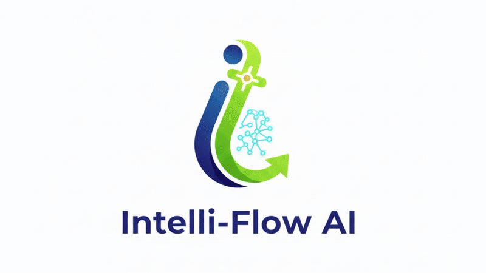
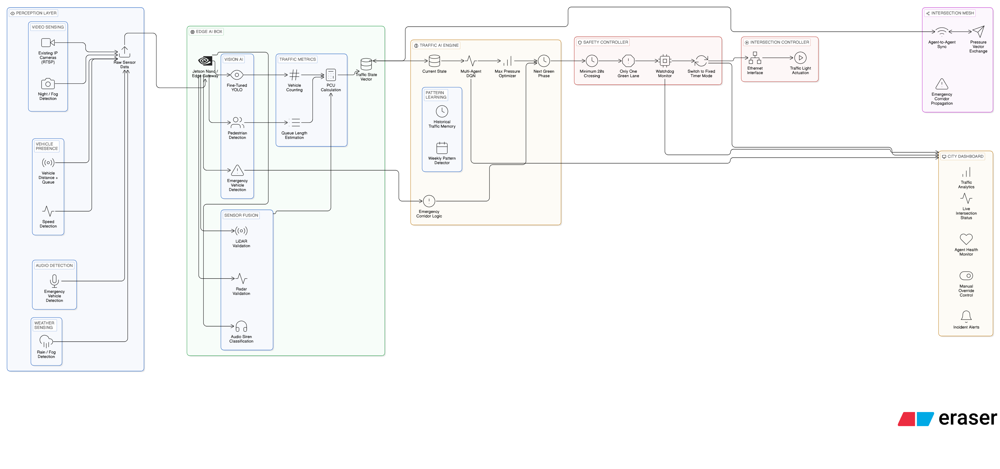

<div align="center">
  
  <h1>Intelli-Flow AI 🚦</h1>
  <p>A Decentralized, Multi-Agent Reinforcement Learning (MARL) framework for adaptive traffic signal control in high-density, unstructured urban environments.</p>
  <p><b>Zero Cloud Dependency | Infinitely Scalable | MCD-Deployment Ready Architecture</b></p>
  
  <p>
    
    
    
    
    
  </p>
</div>

---

<div align="center">

**Live Simulation Demo**


</div>

---

## 🛑 The Problem

Modern cities are plagued by outdated, fixed-time traffic light controllers. These traditional, rigid systems lead to massive problems:

- **Inefficient Flow:** Fixed timers cause agonizing wait times at empty intersections while highly congested opposing lanes are forced to wait.
- **Economic & Environmental Waste:** Wasted fuel and increased carbon emissions due to unnecessary idling.
- **No Emergency Adaptation:** Because of rigid timers, ambulances, fire trucks, and police vehicles are frequently delayed at intersections, losing precious minutes that could determine life or death. Average response times in Indian cities are much higher than optimal, worsening outcomes during critical emergencies.

While global projects like _Alibaba City Brain_ use a **Centralized Cloud** approach, streaming high-definition video from 500+ junctions to a central server requires:

- **Massive Bandwidth:** Over 8 Gigabits per second of continuous city-wide data streaming.
- **Astronomical Infrastructure Costs:** Equipping datacenters with enterprise GPU clusters to decode thousands of videos simultaneously.
- **High Latency & Single Point of Failure:** Central network outages cause city-wide traffic gridlocks. In the Indian context, constant high-speed connectivity to a central cloud is not guaranteed.

---

## 💡 Our Solution: Decentralized Edge MARL

**Intelli-Flow AI** utilizes a **Decentralized Multi-Agent** architecture. Instead of streaming heavy videos to the cloud, each intersection is an "Autonomous Agent" capable of making decisions locally using **Edge AI computing (NVIDIA Jetson)** and **Deep Q-Learning (DQN)**.

1. **Edge-Resilience & Low Latency:** Inference happens at the edge (NVIDIA Jetson) using TensorRT / CUDA / NVIDIA JetPack SDK optimization, removing the 200–500ms round-trip delay to a server.
2. **Cost-Effective Scalability:** Eliminates the need for laying expensive optic fiber cables and maintaining heavy central GPU servers. Adding a new intersection doesn't increase the load on a central server; it simply adds one local compute node.
3. **"Max Pressure" Optimization:** By utilizing Deep Q-Learning, our agents constantly measure the difference between incoming and outgoing congestion (Pressure) to instantly dissolve bottlenecks before gridlock occurs.

---

## ⚙️ How We Achieve It (The Workflow)

Our robust, decentralized architecture combines computer vision, deep reinforcement learning, and peer-to-peer sharing.

<div align="center">
  
</div>

### 1. Perception Layer (The "Indian Road" Factor)

Gathers multi-modal real-time data from the physical intersection.

- **Visual (Heterogeneous Traffic):** High-resolution IP Cameras alongside **Infrared/Thermal Cameras** for robust detection under low-light or adverse weather. Our CV module (Fine-Tuned YOLO model) detects chaotic, heterogeneous Indian traffic (Auto-rickshaws, bikes, heavy trucks, pedestrians).
- **Sensor Fusion:** LiDAR & Radar validate queue distances and speed for robust presence detection.
- **Acoustic:** Audio sensor / Siren detection classifies approaching emergency vehicles beyond line of sight.

### 2. The Edge AI Box (NVIDIA Jetson)

The powerhouse at the traffic pole extracting metrics locally.

- **Traffic Controller Integration (Ethernet):** Seamless hardware interface connecting the edge AI box to existing signal controller cabinets.
- Computes queue lengths and assigns **Passenger Car Unit (PCU)** weights to different vehicles, making the AI prioritize high-capacity buses over private cars.
- Compresses this high-bandwidth video data into a lightweight **Initial State Vector**.

### 3. Traffic AI Engine

The decision-maker running on the Jetson.

- **Multi-Agent DQN:** Analyzes the State Vector and actively decides the next traffic light phase dynamically based on real-time conditions and historical patterns.
  - **State Space ($S$):** `Local_Queue`, `Phase_State` (One-hot encoding), `Neighbor_Pressure`
  - **Action Space ($A$):** Discrete `{Stay_Current_Phase, Switch_to_Next_Phase}`
  - **Custom Reward Function ($R$):** Custom-designed by our team specifically for unstructured traffic. It mathematically balances reducing congestion while heavily penalizing dangerous phase flickering: \
    $R = -(\alpha \cdot \text{QueueLength} + \beta \cdot \text{WaitTime} + \gamma \cdot \text{PhaseSwitches})$
- **Max Pressure logic:** Identifies and relieves lanes with the most dangerous congestion buildup.
- **Emergency Controller Logic:** Visually and acoustically detects approaching ambulances/fire trucks in real-time. Preemptively flushes traffic to create an AI Green Corridor, dropping response latency to near-zero.

### 4. Safety Controller

Hardware-level safety guarantees.

- Enforces Minimum Green Times and Conflict Resolutions to ensure no dangerous light configurations are ever commanded.
- A **Watchdog Monitor** (Galvanic Fail-Safe) reverts to a fixed timer immediately if hardware or model errors are detected.

### 5. Communication-Efficient "V2X-Lite"

- **Peer-to-Peer:** Adjacent intersections share their **Pressure Vectors** peer-to-peer over local ethernet or RF without routing through the cloud.
- Enables **Green Waves**: The AI proactively clears a corridor ahead of incoming heavy congestion or emergency vehicles. This lightweight "Message Passing" protocol ensures the system works even on 4G/low-bandwidth local meshes.

### 6. City Dashboard App (Full Stack)

- A centralized control room pulling low-bandwidth telemetry.
- Built with **Next.js**, UI for visualization, Live Traffic Stats, Edge Agent health alerts, and manual agent state control if necessary.

---

## 🏆 Competitive Advantage (USP)

| Feature                    | Legacy Timers | Cloud "Smart" Systems | Intelli-Flow AI               |
| :------------------------- | :------------ | :-------------------- | :---------------------------- |
| **Traffic Adaptation**     | Static        | Reactive              | **DQN Driven Predictive**     |
| **Network Dependency**     | Offline       | Online                | **Sovereign 100% Offline**    |
| **Emergency Routing**      | No            | High Latency          | **Zero-Latency Multi-Modal**  |
| **Asymptotic Scaling**     | Linear        | Exponential           | **Constant O(1)**             |
| **Data Privacy & InfoSec** | No Data       | Streamed              | **Zero Video Uplink**         |
| **BrownField Integration** | Baseline      | Requires Fibre        | **Frictionless Edge Bolt-On** |

### Key Technological Pillars:

- Sovereign Edge Compute
- Native Traffic AI
- Constant O(1) Asymptotic Scaling
- Zero Video Uplink (High Privacy)
- Frictionless Edge Bolt-On

---

## ✨ Future & Advanced Capabilities

Intelli-Flow AI is built to expand into a complete Smart City Ecosystem:

- **🚶 Pedestrian-Centric Optimization:** Dynamically adjusting crosswalk times based on pedestrian density detected via CV.
- **🍃 Emission-Aware Routing:** Integrating sensors to detect high CO2 levels and "flushing" traffic from those zones to reduce local pollution spikes.
- **🚌 Public Transport Priority (TSP):** Detecting city buses via CV and slightly extending green phases to ensure public transit remains on schedule.
- **Robustness via Domain Randomization:** Training models with injected "Observation Noise" to simulate camera lag, dust/fog occlusions, and sensor dropouts, ensuring safe decisions even with "fuzzy" real-world data.

---

## 🛠️ Tech Stack & Current Prototype

This repository contains the core Deep Reinforcement Learning algorithms and dashboard interface prototyped over the **SUMO Simulator** for stress-testing under extreme Delhi-traffic scenarios.

- **Edge Compute:** NVIDIA Jetson Nano, TensorRT, CUDA, Ubuntu (JetPack SDK)
- **AI Core:** Python, TensorFlow / Keras (Multi-Agent DQN)
- **Perception Vision:** YOLOv8
- **Simulation Environment:** SUMO (Simulation of Urban MObility) & TraCI
- **API & Networking:** Flask, Ethernet / Wired Connectivity, REST APIs
- **City Dashboard:** Next.js 14, React 18, Tailwind CSS, TypeScript

---

## 🚀 Getting Started (Simulation Prototype)

To run our Deep Reinforcement Learning model and interactive dashboard using the SUMO environment locally:

### Prerequisites

- Python 3.8+
- SUMO installed and the `SUMO_HOME` environment variable configured.
- Node.js and npm

### Installation & Launch

1. **Clone the repository:**

   ```sh
   git clone https://github.com/yash-Bansal10/Intelli-Flow-AI.git
   cd Intelli-Flow-AI
   ```

2. **Launch the AI Core (Backend):**

   ```sh
   cd ai_core
   python -m venv venv
   # Windows: .\venv\Scripts\activate | Mac/Linux: source venv/bin/activate
   pip install -r requirements.txt
   ```

   _Note: Update `SUMO_CONFIG_PATH` if needed in `train.py` / `traffic_env.py`._

   ```sh
   python train.py
   ```

3. **Launch the City Dashboard (Frontend):**
   Open a new terminal.

   ```sh
   cd traffic-dashboard_main
   npm install
   npm run dev
   ```

4. **Monitor the Flow:**
   Navigate to `http://localhost:3000` to view the AI's training process and live response within the SUMO interactive simulator.

---

## 📚 References & Research Papers

- **Multi-Agent Reinforcement Learning:** [arXiv:2505.14544v3](https://arxiv.org/html/2505.14544v3)
- **Max Pressure Algorithm:** [arXiv:2202.03290](https://arxiv.org/pdf/2202.03290)
- **Deep Q-Network:** [arXiv:1711.07478](https://arxiv.org/pdf/1711.07478)
- **Real Time Object Detection:** [ScienceDirect](https://www.sciencedirect.com/science/article/pii/S1110016825003850)

---
