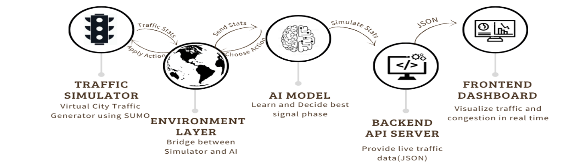

<div align="center">
  
  <h1>Intelli-Flow AI 🚦</h1>
  <p>An intelligent, adaptive traffic control system powered by Deep Reinforcement Learning.</p>
  
  <p>
    
    
    
    
    
  </p>
</div>

---

<div align="center">

**Live Demo**


</div>

---

## 📖 Overview

Intelli-Flow AI is a smart traffic management solution designed to replace outdated, inefficient fixed-time traffic light controllers. Traditional systems are blind to real-time conditions, leading to unnecessary congestion, wasted fuel, and increased travel times. 

Our solution uses a **Deep Q-Network (DQN)**, a reinforcement learning agent, to create a dynamic and responsive system. The AI constantly observes traffic queues and makes intelligent decisions to optimize flow, applying a **"max pressure"** policy to relieve the most congested lanes first. This project proves that an AI agent can learn complex traffic control strategies and significantly outperform traditional methods.

This project was developed for the **Smart India Hackathon (SIH)**.

---

## ✨ Key Features

-   🧠 **Intelligent Agent:** A DQN model built with TensorFlow that learns and adapts to changing traffic patterns.
-   🚗 **Realistic Simulation:** Built on the **SUMO (Simulation of Urban MObility)** platform for high-fidelity traffic modeling.
-   📊 **Live Dashboard:** A real-time web interface built with Next.js and Tailwind CSS to visualize intersection stats and AI decisions.
-   ⚡ **Dynamic Control:** Applies a "max pressure" policy to prioritize lanes with the heaviest traffic, minimizing overall congestion.
-   📈 **Performance Analytics:** Tracks key metrics and displays the agent's learning progress over time.

---

## 🏗️ System Architecture

The system operates in a continuous loop, allowing the AI to learn and adapt in real-time. The traffic simulator provides the state, the AI chooses an action, and the backend/frontend layers visualize the results.

<div align="center">
  
</div>

---

## 🛠️ Tech Stack

-   **AI / Reinforcement Learning:** Python, TensorFlow, Keras
-   **Simulation:** SUMO (Simulation of Urban MObility)
-   **Backend API:** Flask & Flask-CORS
-   **Frontend / Dashboard:** Next.js, React, Tailwind CSS
-   **Data Visualization:** Chart.js

---

## 🚀 Getting Started

To get a local copy up and running, follow these simple steps.

### Prerequisites

-   Python 3.8+
-   SUMO installed and the `SUMO_HOME` environment variable configured.
-   Node.js and npm (or yarn)

### Installation & Launch

1.  **Clone the repository:**
    ```sh
    git clone [https://github.com/yash-Bansal10/Intelli-Flow-AI.git](https://github.com/yash-Bansal10/Intelli-Flow-AI.git)
    cd Intelli-Flow-AI
    ```

2.  **Set up the Python Backend:**
    -   Navigate to the AI core directory:
        ```sh
        cd ai_core
        ```
    -   Create and activate a virtual environment:
        ```sh
        # On Windows
        python -m venv venv
        .\venv\Scripts\activate
        ```
    -   Install the required Python packages:
        ```sh
        pip install -r requirements.txt
        ```
    -   **Important:** Open `train.py` and `traffic_env.py` and update the `SUMO_CONFIG_PATH` variable to point to your local SUMO configuration file (`.sumocfg`).
    -   Start the AI training script and backend server:
        ```sh
        python train.py
        ```

3.  **Set up the Frontend Dashboard:**
    -   Open a **new terminal**.
    -   Navigate to the frontend directory (you'll need to create this part or use the provided API server with a tool like Postman).
    -   Install npm packages and run the development server:
        ```sh
        # Example for a Next.js dashboard
        # cd frontend
        # npm install
        # npm run dev
        ```

4.  **View the Dashboard:**
    -   Open your browser and go to `http://localhost:3000` to see the live traffic simulation and AI performance.

---

## 🔮 Future Scope

-   **Multi-Agent Systems:** Expand from a single intersection to a network of coordinated AI agents that manage traffic across an entire city grid.
-   **Predictive Analytics:** Integrate real-world data sources (weather, public events, GPS data) to anticipate traffic surges before they happen.
-   **Emergency Vehicle Prioritization:** Train the AI to recognize and create "green waves" for ambulances and fire trucks.
-   **Hardware Deployment:** Optimize the model to run on low-cost edge devices (like NVIDIA Jetson or Raspberry Pi) for real-world deployment.

---

## 🤝 Contributing

Contributions, issues, and feature requests are welcome! Feel free to check the issues page.

---

## 📄 License

Distributed under the MIT License. See `LICENSE` for more information.

---

## 👨‍💻 Founder

**Yash Bansal**

-   **LinkedIn:** [https://www.linkedin.com/in/iamyashbansal/](https://www.linkedin.com/in/iamyashbansal/)
